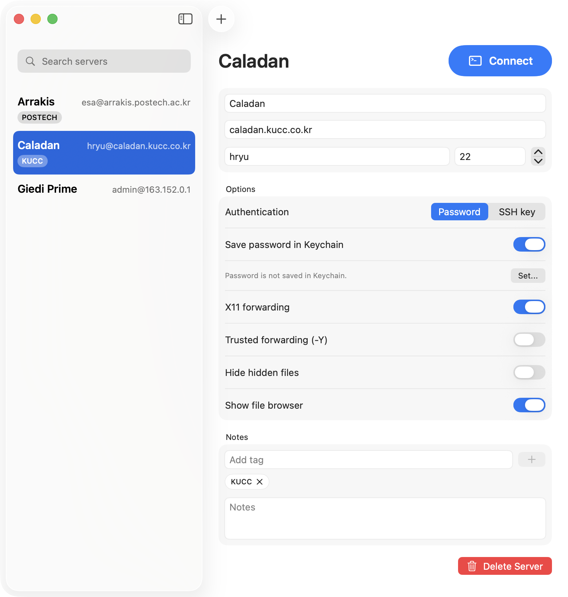

# Ornithopter

A simple, free SSH client for macOS with a lightweight terminal-focused workflow and easy file transfers.

## Install

Installation instructions will be added with the first release.

## Features

- Manage SSH server profiles with host, username, port, notes, and tags.
- Connect with password authentication, Keychain-stored passwords, or SSH key files.
- Use multiple terminal tabs and split views.
- Browse, create, rename, delete, copy, paste, upload, and download remote files and folders.
- Enable X11 forwarding with `-X` or trusted `-Y` mode per server. Requires XQuartz.
- Open supported text files with a configurable terminal editor.

## License

Ornithopter is released under the MIT License. See [LICENSE](LICENSE).

## Attribution

Ornithopter uses [SwiftTerm](https://github.com/migueldeicaza/SwiftTerm). See [THIRD_PARTY_NOTICES.md](THIRD_PARTY_NOTICES.md) for third-party license notices.

This project was developed with assistance from Codex and reviewed by H. Ryu.
